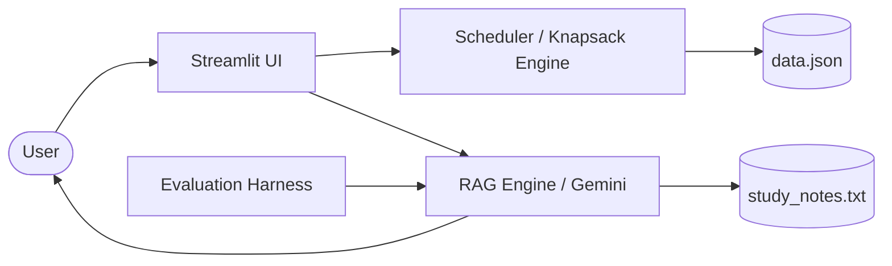

# OptiPaw Applied AI System — AI Pet Care Scheduler

> A Streamlit-based pet care planning app that combines rule-based scheduling with human-readable tests and a small retrieval-augmented answer workflow.

## Summary

OptiPaw Applied AI System helps a pet owner turn tasks into a daily plan using multiple scheduling strategies, recurrence handling, conflict detection, and data persistence. The system also includes an evaluation harness for human-like testing of answer quality.

---

## Original Project Context (Modules 1-3)

### Module 1 — Core scheduling backend
- Implemented in `pawpal_system.py`.
- Defines `Owner`, `Pet`, `Task`, `Scheduler`, `ScheduledEntry`, and `DailyPlan`.
- Supports priority, time, and priority-time scheduling strategies.
- Includes recurrence expansion, conflict detection, overdue logic, and JSON persistence.

### Module 2 — Streamlit UI
- Implemented in `app.py`.
- Collects owner, pet, and task input from the user.
- Saves state to `data.json` and reloads automatically.
- Displays task tables, scheduling options, validation feedback, and plan summaries.

### Module 3 — Testing and evaluation
- Core tests live in `tests/test_pawpal.py`.
- Added `test_runner.py` to exercise query-based evaluation and output validation.
- `rag_engine.py` provides a retrieval-assisted answer path using `study_notes.txt` and a Gemini-based LLM call.

---

## Architecture Overview

The app is built as a small modular system:

- `app.py` — user-facing Streamlit interface
- `pawpal_system.py` — scheduler and data model
- `data.json` — persisted owner/pet/task state
- `study_notes.txt` — local context for retrieval
- `rag_engine.py` — query + retrieval + LLM answer generation
- `test_runner.py` — evaluation harness for test queries
- `tests/test_pawpal.py` — automated unit and integration tests

The data flow is:
1. User input enters the Streamlit UI.
2. `app.py` saves owner/pet/task data to `data.json`.
3. `pawpal_system.py` generates the daily plan using one of the scheduling strategies.
4. `rag_engine.py` is available for retrieval-based answering using `study_notes.txt` and the LLM.
5. `test_runner.py` validates response quality and reports pass/fail results.

---

## Setup Instructions

1. Open a terminal in the project root.
2. Create and activate a virtual environment:

```bash
python -m venv .venv
# macOS / Linux
source .venv/bin/activate
# Windows PowerShell
.\.venv\Scripts\Activate.ps1
```

3. Install dependencies:

```bash
pip install -r requirements.txt
```

4. Run the app:

```bash
streamlit run app.py
```

5. Run the unit tests:

```bash
python -m pytest tests/test_pawpal.py -v
```

6. Run the evaluation harness:

```bash
python test_runner.py
```

> If you use `rag_engine.py`, make sure your Gemini API key is available as `GEMINI_API_KEY` in your environment.

---

## Sample Interactions

### Example 1
**User:** Add a dog walk task at 08:00 with priority 5.
**App:** _[paste expected response here]_

### Example 2
**User:** Add a cat feeding task and generate today’s plan.
**App:** _[paste expected response here]_

### Example 3
**User:** Ask the RAG engine about pet vaccination guidelines.
**App:** _[paste expected response here]_

### Example 4
**User:** Run the evaluation harness and confirm confidence score.
**App:** _[paste expected response here]_

---

## Testing Summary

- `pytest tests/test_pawpal.py -v` checks scheduling rules, recurrence, conflict detection, and plan output.
- `python test_runner.py` validates the RAG/evaluation flow and reports a pass/fail rate.
- Current project test confidence: **61/61 tests passing**.



---

## Loom Video

📽️ _Add your Loom video link here_
