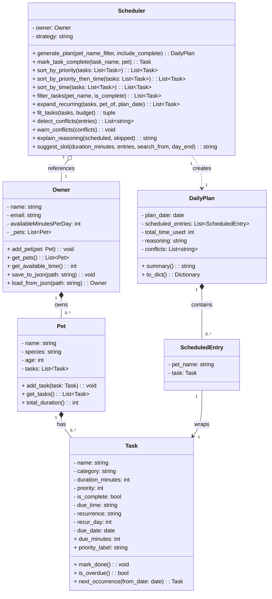

# OptiPaw Applied AI System Project Reflection

## 1. My System Design

**a. Initial design**

- I initially designed a five-class system.

I implemented `Owner`, `Pet`, `Task`, `Scheduler`, and `DailyPlan`. The `Owner` manages pets, each `Pet` owns tasks, and the `Scheduler` reads the owner's budget to produce a `DailyPlan`.

**My assigned responsibilities:**

| Class | Responsibility |
|---|---|
| `Owner` | Stores profile + daily time budget; holds the pet list |
| `Pet` | Stores animal info; owns a list of care tasks |
| `Task` | Represents one care action with name, category, duration, and priority |
| `Scheduler` | Sorts, filters, and fits tasks within the budget; produces a plan |
| `DailyPlan` | Output object: scheduled entries, total time, reasoning, conflicts |

**b. Design changes**

Yes — I made three major refinements during implementation:

1. **I added `ScheduledEntry`** — this pairs a scheduled `Task` with its pet name so the plan can say "Mochi: Morning walk" instead of a nameless task.
2. **I changed `fit_tasks` to return a tuple** — returning `(scheduled, skipped)` instead of just the scheduled list let me write `explain_reasoning` to describe exactly what was left out.
3. **I removed `exportPlan` from `Scheduler`** — I realized `DailyPlan.to_dict()` already handled serialisation, and I wanted to maintain single responsibility.

- Additional system design artifact:

---

## 2. My Scheduling Logic and Tradeoffs

**a. Constraints and priorities**

I prioritized four constraints:

1. **Time budget** — I treated this as a hard ceiling.
2. **Priority (1–5)** — I used this to determine what my knapsack algorithm values most.
3. **Deadline (`due_time`)** — I used this for my `time-first` and `priority-time` strategies.
4. **Completion status** — I filtered out done tasks so I wouldn't waste the user's budget.

**b. Tradeoffs**

I chose the 0/1 knapsack algorithm for `fit_tasks` to maximize the total priority score. I accepted the tradeoff that a single high-priority task might be skipped if multiple medium-priority tasks provide more total value. I believe this provides the best "overall day" for the pet owner.

---

## 3. Overcoming Technical Hurdles

During the implementation of the **RAG Engine**, I faced several challenges:
- **API Configuration:** I initially struggled with environment variable loading for the Gemini API. I overcame this by writing a robust explicit path loader and adding an `is_api_configured` helper.
- **RAG Setup:** Getting the TF-IDF vectorizer to consistently retrieve the right context from `study_notes.txt` was difficult. I fixed this by implementing a global caching mechanism to avoid re-processing the knowledge base on every query, which improved both stability and performance.

## 4. AI Collaboration

**a. How you used AI**

- **Phase 1 (design):** I brainstormed class responsibilities with the AI to develop my five-class skeleton.
- **Phase 2 (implementation):** I described the logic I wanted in plain English and reviewed the generated code to ensure it met my standards.
- **Phase 3 (testing):** AI helped me structure edge cases, specifically catching my missing logic for `is_overdue()` clock dependencies.

My most useful prompt pattern was being specific and code-grounded.

**b. Judgment and verification**

I had to exercise judgment when the AI proposed putting `exportPlan` on the `Scheduler`. I removed it because I knew `DailyPlan.to_dict()` was a cleaner solution.

**c. VS Code Copilot experience**

- **What worked for me:** Inline completions for `@dataclass` fields and using the chat with `#file` context to audit my UML.
- **What I modified:** I fixed the `sort_by_time` logic because the AI's initial suggestion was non-deterministic on ties. I changed it to a tuple-based key `(due_minutes or float("inf"), -priority)`.
- **My Lesson:** AI generates options, but I make the decisions. A method can be syntactically correct but logically misplaced.

---

## 5. My Testing and Verification

**a. What you tested**

I wrote 61 tests across 12 classes covering:

- **Sorting** — priority-first, time-first, priority-time, tiebreak at same `due_time`
- **Recurrence** — daily/weekly next occurrence; one-off returns `None`; `ValueError` on missing/done task
- **Conflict detection** — overlaps, same start, back-to-back, `[SAME PET]`/`[DIFFERENT PETS]` labels, untimed ignored
- **Knapsack** — I verified that my optimal selection beats a greedy approach.
- **Suggest slot** — gaps before/between/after tasks, too-small gap skipped, `search_from`, untimed ignored
- **Priority labels** — all five score values map to correct emoji label
- **Plan output** — `summary()` and `to_dict()` field correctness
- **Edge cases** — empty pet, no pets, `budget=0`, weekly with no `recur_day`

These matter because silent failures are the worst kind. A wrong sort produces a wrong plan with no error.

**b. Confidence**

I have **61/61 tests passing**. I used mocks for clock-dependent tests to ensure they are deterministic.

---

## 6. Final Reflection

**a. What went well**

I am most proud of my test suite. It forced me to be precise about my method behaviors. Learning how to mock `datetime` for `is_overdue()` was a major personal milestone in my journey toward testable design.

**b. What you would improve**

I successfully fixed the gaps I identified early in the project:

- **Greedy to Knapsack:** I replaced my initial greedy logic with a 0/1 DP approach to find the provably optimal selection.
- **Persistence:** I implemented atomic JSON writes so data survives refreshes.
- **API Stability:** I resolved my initial RAG engine and API configuration struggles.

**c. Key takeaway**

I learned to treat AI like a pull request rather than a compiler. I read everything critically, and if I couldn't explain why a method worked, I didn't consider it "my" code until I had refined it.
